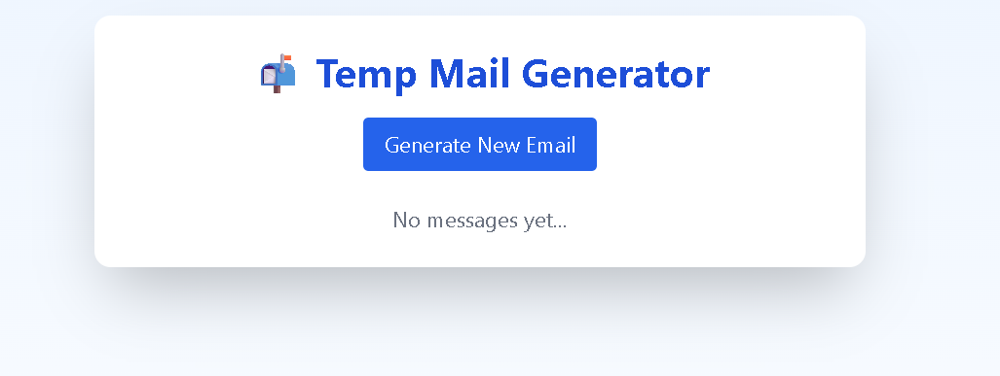
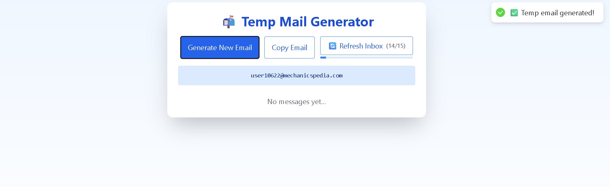

# 📬 Temp Mail Generates (React)

A modern, responsive temp mail (disposable email) web app built using **React** and **Tailwind CSS**, integrated with the free [Mail.tm API](https://docs.mail.tm/).

> Instantly generate a temporary email address, receive and read emails, and auto-refresh your inbox like a real email client.

---

## ✨ Features

- 📧 Generate random temporary email address
- 📥 Fetch incoming messages
- 🔄 Auto-refresh inbox every 15 seconds
- ⏱ Countdown timer with progress bar
- 📝 Popup view for reading full messages
- 📋 Copy email to clipboard
- 🎨 Beautiful UI using Tailwind CSS
- 📱 Fully responsive on all screen sizes

---

## 🔗 Live Demo

👉 [Visit Live Website](https://your-vercel-url.vercel.app)  
_Deployed using [Vercel](https://vercel.com)_

---

## 🧰 Tech Stack

- **Frontend**: React, Tailwind CSS
- **API**: [Mail.tm REST API](https://docs.mail.tm/)
- **Icons & UI**: Emojis, Custom styles
- **Hosting**: Vercel (Free)

## 📷 Screenshots



 

---

## 📦 Installation (Local)

1. **Clone the repo**

```bash
git clone https://github.com/Rohit-Patel-Techie/temp-mail-app/
cd temp-mail-react

2. Install dependencies
npm install

3. Run the app
npm start

📡 API Used: Mail.tm
- Create random email using /domains + /accounts
- Login using /token
- Fetch inbox with /messages
- Get full email using /messages/:id

🙏 Credits
- Mail.tm – Open-source disposable mail API
- Tailwind CSS – Utility-first CSS framework
- React Hot Toast – Toast notifications
